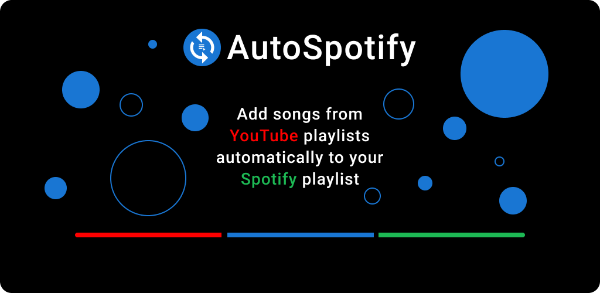
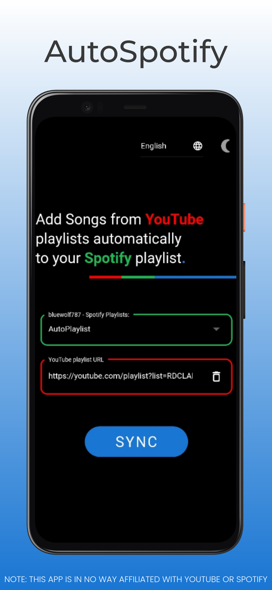
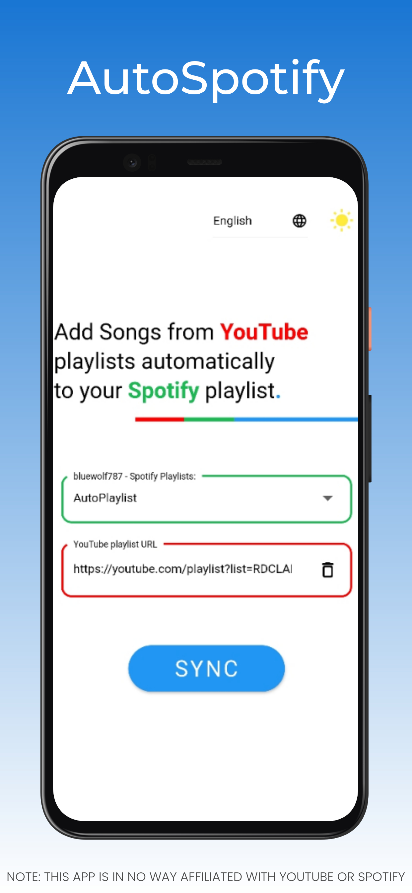

 
 
 

<!-- -->

#  AutoSpotify

> This mobile app built in [Flutter](https://flutter.dev/) is used to search in YouTube playlist for songs and add these to a Spotify playlist.

----

## Table of Contents
- [ AutoSpotify](#-autospotify)
  - [Table of Contents](#table-of-contents)
  - [Screenshots](#screenshots)
  - [Technologies](#technologies)
  - [Contributing](#contributing)
  - [Collaborators](#collaborators)
  - [License](#license)

## Screenshots

 | 
-------------------------------------------------- | --------------------------------------------

## Technologies

|  |  |  |
| :---: | :---: | :---: |
| [Flutter](https://flutter.dev/) | [Firebase (FlutterFire)](https://firebase.flutter.dev/) | [Dart packages (pub.dev)](https://pub.dev) |
|  | [Authentication](https://pub.dev/packages/firebase_auth) | [spotify-dart](https://pub.dev/packages/spotify) |
|  | [Cloud Firestore](https://pub.dev/packages/cloud_firestore) | [youtube_explode_dart](https://pub.dev/packages/youtube_explode_dart) |
|  |  | [connectivity](https://pub.dev/packages/connectivity) |
|  |  | [data_connection_checker](https://pub.dev/packages/data_connection_checker) |
|  |  | [theme_provider](https://pub.dev/packages/theme_provider) |
|  |  | [page_transition](https://pub.dev/packages/page_transition) |

## Contributing

Please read [CONTRIBUTING.md](CONTRIBUTING.md) for details on the code of conduct, and the process for submitting pull requests.

## Collaborators
  * [Bluewolf787](https://github.com/Bluewolf787)
 
## License

This project is licensed under the MIT License - see the [LICENSE.md](LICENSE.md) file for details
