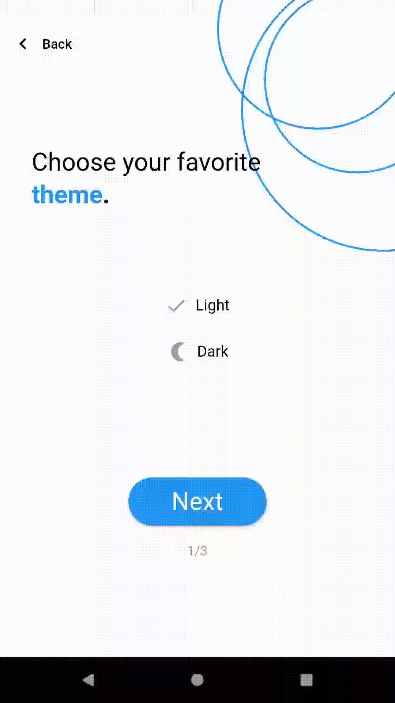

# AutoSpotify

> This mobile app built in [Flutter](https://flutter.dev/) is used to search in YouTube playlist for songs and add these to a Spotify playlist.

----

## Table of Contents
- [AutoSpotify](#autospotify)
  - [Table of Contents](#table-of-contents)
  - [Screenshots](#screenshots)
  - [Technologies](#technologies)
  - [Collaborators](#collaborators)
  - [Logo Credits](#logo-credits)
  - [TODO](#todo)

## Screenshots

 | 
-------------------------------------------------- | --------------------------------------------

## Technologies

|  |  |  |   |
| :---: | :---: | :---: | :---: |
| [Flutter](https://flutter.dev/) | [Firebase (FlutterFire)](https://firebase.flutter.dev/) | [spotify-dart](https://pub.dev/packages/spotify) | [youtube_explode_dart](https://pub.dev/packages/youtube_explode_dart) |
|  | [Authentication](https://pub.dev/packages/firebase_auth) |  |  |
|  | [Cloud Firestore](https://pub.dev/packages/cloud_firestore) |  |  |

## Collaborators
  * [Bluewolf787](https://github.com/Bluewolf787)
 
## Logo Credits
  * [Folder icon](https://iconscout.com/icon/musicfolder-1706780) by [Itim2101](https://iconscout.com/contributors/komkrit-noenpoempisut)
  * [Spotify icon](https://iconscout.com/icon/spotify-2690370) by [Anton Kalashnyk](https://iconscout.com/contributors/kolo-design)
  * [YouTube icon](https://iconscout.com/icon/youtube-2690358) by [Anton Kalashnyk](https://iconscout.com/contributors/kolo-design)

## TODO
  * [ ] Bug fixes and improvments
  * [ ] Error handling
  * [ ] Better network connection checks
  * [ ] Design changes
  * [ ] Testings
